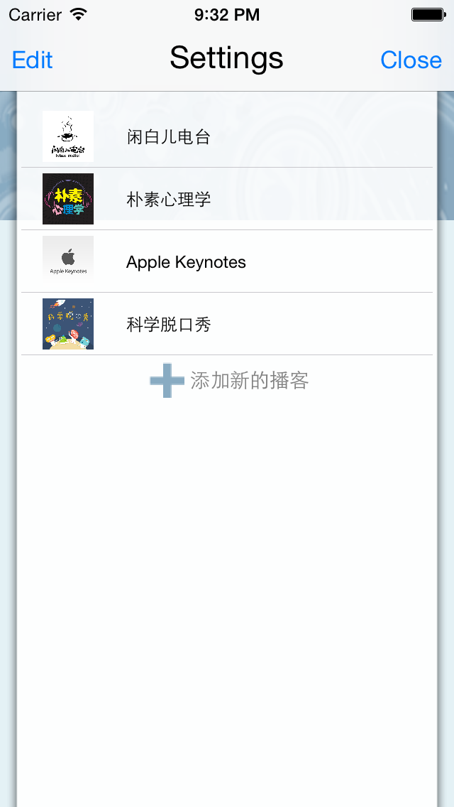
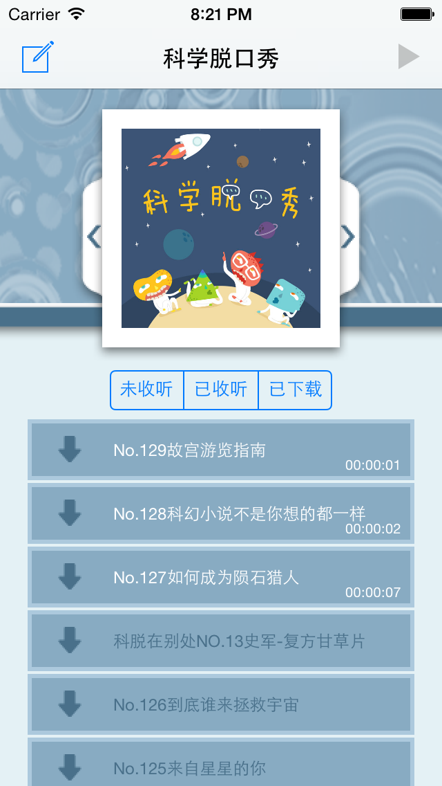
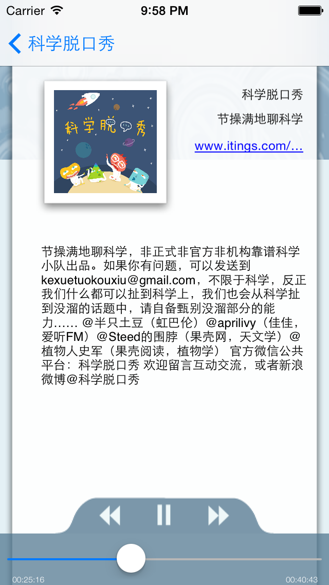
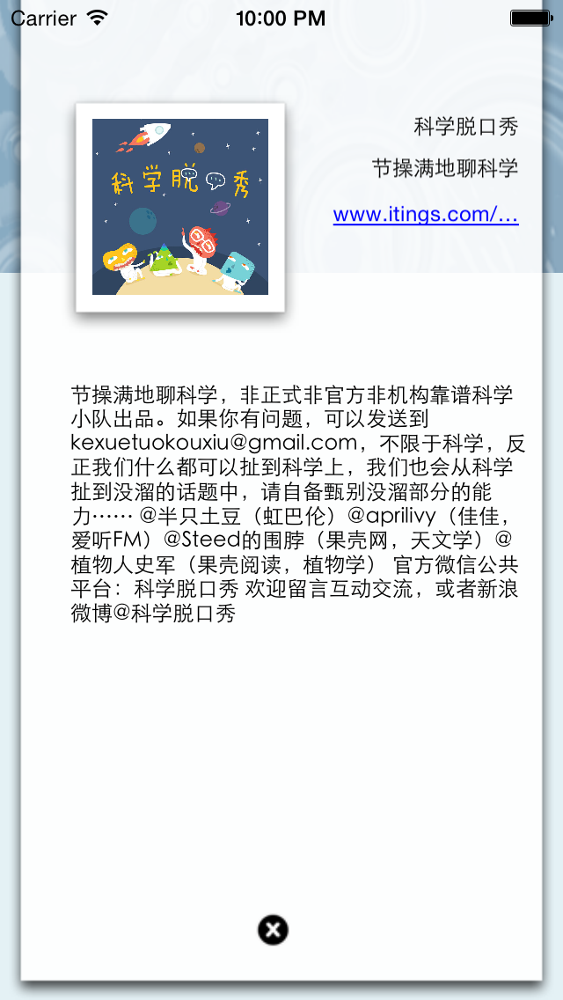

PodSnatcher for iOS
==========================
PodSnatcher 是一个 Web OS 平台的播客应用。 项目地址：[PodSnatcher](https://github.com/wahvee/podsnatcher-webos)  
出于学习 iOS 开发的目的，我将 PodSnather 移植到 iOS 上面，并且稍稍修改了一些界面。

说明
---------------------------
使用 itunes 数据源  
core data 作为数据存储  
cocoapods 依赖管理  

使用 FreeStreamer 播放引擎  
MWFeedParser 解析 podcast 数据

使用依赖
---------------------------
[FreeStreamer](https://github.com/muhku/FreeStreamer)  
[SwipeView](https://github.com/nicklockwood/SwipeView)  
[MWFeedParser](https://github.com/mwaterfall/MWFeedParser)  
[TTTAttributedLabel](https://github.com/mattt/TTTAttributedLabel)  
[SVPullToRefresh](https://github.com/samvermette/SVPullToRefresh)  

截图
---------------------------

TODO
---------------------------------
- 视频播放
- 国际化
- 主界面显示播放时间
- 播客顺序调整

LICENSE
---------------------------------

BSD 2 license

